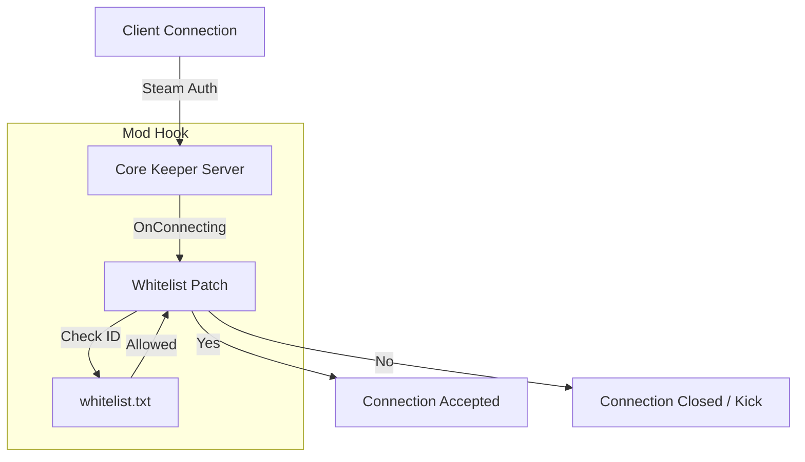

# Core Keeper Dedicated Server Whitelist Mod (Mono Version) - Design Document

## 1. プロジェクト概要

### 目的
Core Keeper Dedicated Server (Docker版) において、標準機能に存在しない「ホワイトリスト形式の接続制限」を実装する。
サーバー内部のネットワーク処理に介入し、**未承認ユーザーの接続をハンドシェイク段階（Steam認証直後）で切断**することで、ワールドデータの保護と不正侵入の完全な阻止を実現する。

### 技術スタック
- **Platform:** Windows (開発) / Linux Docker (本番)
- **Runtime:** **Mono** (Unity Standard Runtime)
- **Framework:** **.NET Standard 2.1**
- **Mod Loader:** **BepInEx v5.4.22** (Stable / Mono)
- **Patching:** HarmonyLib (BepInEx同梱)

### アーキテクチャ


# 2. Development Environment (Windows)

解析とビルドは Windows 上で行い、成果物 (.dll) を Linux サーバーへデプロイする。

必須セットアップ
サーバー本体: Core Keeper Dedicated Server (Windows版)

Mod Loader: BepInEx v5.4.22 (x64)

依存解決:

CoreKeeperServer_Data/Managed/ 内の競合するDLL (0Harmony.dll, Mono.Cecil.dll 等) をリネームまたは削除し、BepInEx側のDLLが優先されるように構成済みであること。

参照設定 (References)
ビルドには以下のDLLへの参照が必要（すべて Managed フォルダ内に存在）。

Facepunch.Steamworks.Win64.dll (Steam関連の型定義)

Pug.Platform.dll (SteamNetworkingクラス)

BepInEx.dll (Mod Loader本体)

0Harmony.dll (パッチ用)

# 3. Implementation - Project File (.csproj)

## 設定のポイント
- TargetFramework は `netstandard2.1` に固定する (Mono環境用)。
- 参照パス (`HintPath`) は、Serverの `CoreKeeperServer_Data/Managed/` 配下のDLLを指定する。

# 4. Implementation - Source Code (Plugin.cs & Patch)

## フック対象
- **Class**: `Pug.Platform.SteamNetworking`
- **Method**: `OnConnecting`
- **Logic**:
    - `ConnectionInfo` から `SteamId` を取得。
    - ホワイトリスト (`whitelist.txt`) と照合。
    - 不許可の場合、`connection.Close()` で切断し、return `false` で元の処理をキャンセルする。

# 5. Deployment Configuration

コンテナ再作成時もMod環境を維持するため、ホスト側のディレクトリをマウントし、
起動コマンドを BepInEx 用のラッパースクリプトに差し替える。

```
/opt/gameserver/corekeeper/
├── run_bepinex.sh             # (新規) 起動スクリプト
├── BepInEx/                   # (新規) BepInEx本体
│   ├── config/
│   └── plugins/
│       ├── CoreKeeperWhitelist.dll  # (新規) ビルドしたMod
│       └── whitelist.txt            # (新規) IDリスト
└── ... (既存のサーバーファイル)
```

